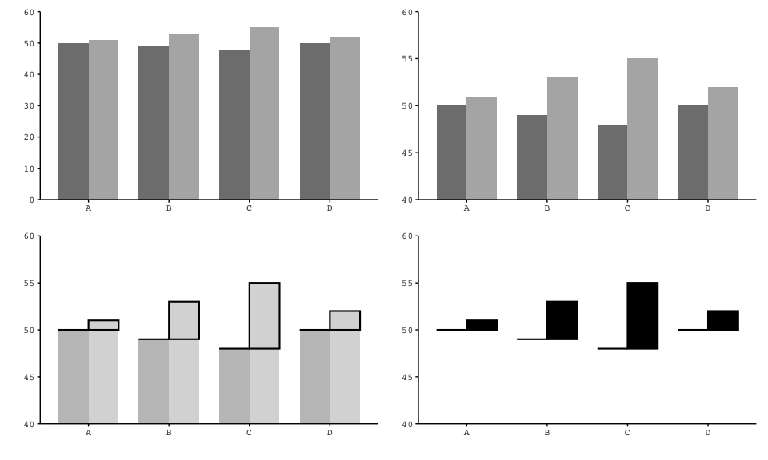
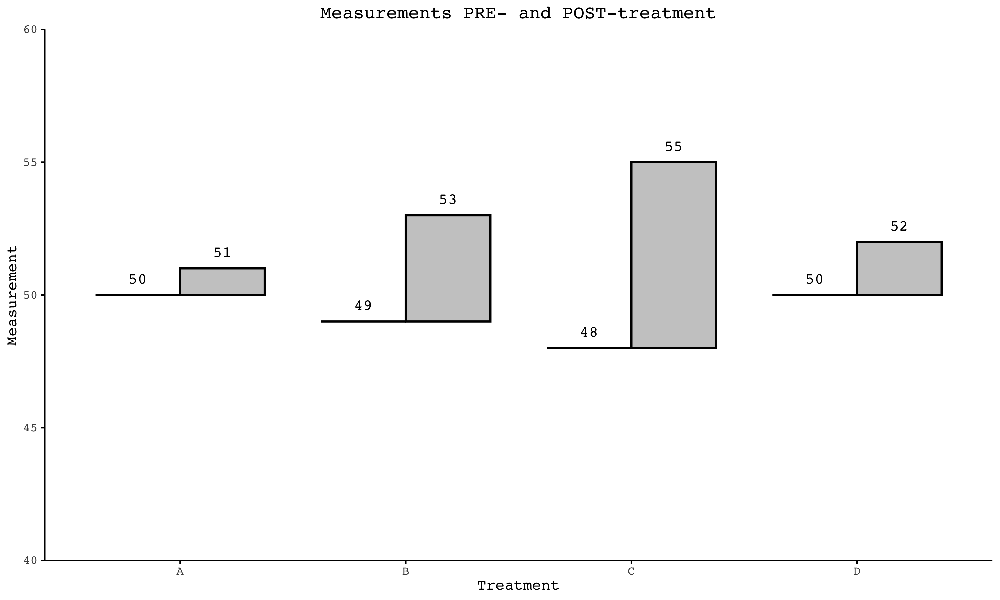
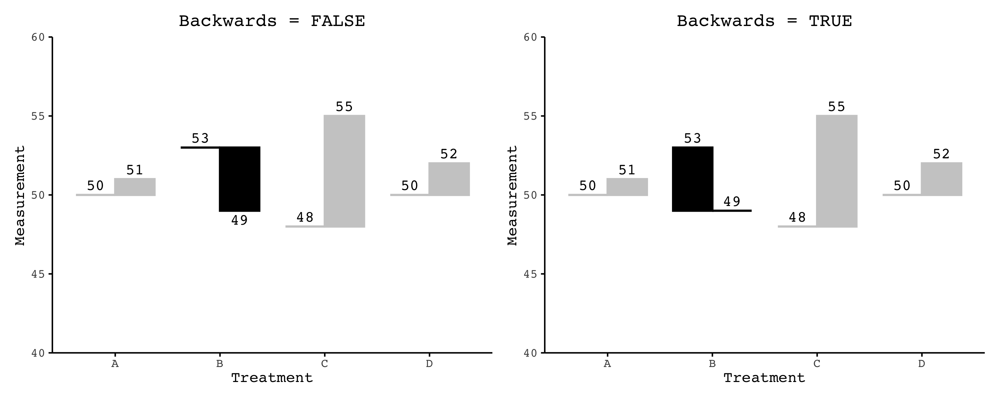
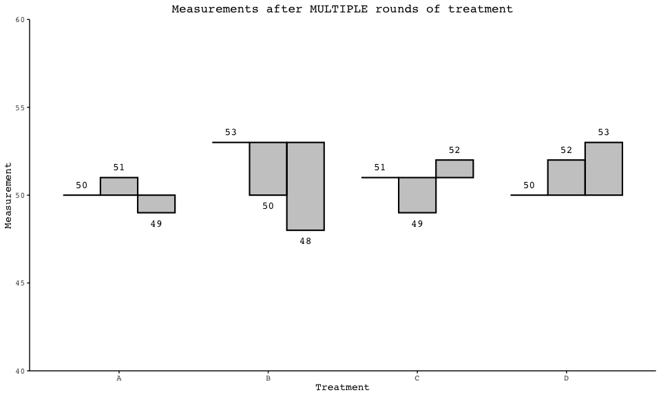

<!-- README.md is generated from README.Rmd. Please edit that file -->

# gghat

<!-- badges: start -->
<!-- badges: end -->

The goal of `gghat` is to add functionality to `ggplot`, such that hat
graphs are included in its repertoire. To this end, `gghat` contains
`geom_hat()` as well as compatible position functions to be used with
`geom_text()` and `geom_errorbar`. You can install the development
version of `gghat` from [GitHub](https://github.com/eliashyde/gghat).
Obviously, `gghat` also requires that `ggplot` is installed. In fact, I
would recommend that the user installs the entire `tidyverse` too, as it
contains a host of useful packages.

``` r
# install.packages("devtools")
# library(devtools)
# devtools::install_github("eliashyde/gghat")
```

``` r
library(gghat)
library(patchwork)
library(randomizr)
library(estimatr)
library(tidyverse)
library(vayr)
```

Comparative bar graphs — in which bars are paired or otherwise grouped —
are useful because they give a strong visual impression. As always,
though, we must be conscientious of how we are curating this impression.
Starting the y-axis at zero has long since been the golden rule with
these types of plots, lest the relative lengths of truncated bars
mislead the viewer with a lie factor greater than one (Tufte, 2001).
That said, a y-axis that begins at zero may minimize statistically
significant treatment effects in comparative bar graphs, rendering them
visually insignificant. In a recent paper, Jessica Witt suggests that we
derive our y-ranges from standard deviation when possible to increase
sensitivity, reducing the discrepancy between actual and perceived
effect size (Witt, 2019a).

How, then, might we mitigate the negative effects of an abbreviated
y-axis? We could plot only the differences between groups, allowing us
to start our y-axis at zero while also limiting it to a reasonable
range. In doing so, though, we would lose contextualizing information —
namely, the raw values. Or instead of bars, we could plot points, which
visually retain only relative position and thus do not suffer from
non-zero baselines. But Witt argues that points do not cater to the
principles of grouping, failing to “facilitate the perceptual grouping
of pairs” (Witt, 2019b). Of course, we could connect the grouped points
with lines, but this isn’t ideal either because lines imply continuous
variables; they are less suited for discrete data (Zacks & Tversky,
1999).

Witt explains that comparative bar graphs need not fall by the wayside,
at least not entirely; they need only be redesigned. Rather than
equivocate, negotiating the aforementioned trade-offs, she presents the
hat graph, a new visualization of bar-graph descent that allows for
“proper interpretation of discrete categories” and the use of
“unrestricted settings for the y-axis” (Witt, 2019b). From a pair of
bars in a bar graph, a hat graph would retain both heights as horizontal
lines; it would also retain a bit of the body of the second bar to
represent the difference between the two heights, resulting in a hat
shape. The steps are illustrated below. The “brim” of each hat marks one
value (e.g., either pre-treatment or without treatment) and the “crown”
marks another (e.g., either post-treatment or with treatment), while the
profile reflects the difference therebetween (Witt, 2019b). As Tufte
would recommend, this gets rid of redundancy. Moreover, as a graphic for
difference, the profile has a lie factor of one, while the brim and
crown are retained as annotations so as not to lose sight of the actual
data values Hat graphs are efficient, requiring very little work on
behalf of the viewer — although they are still novel, so it is to be
expected that they occasion brief pause.



It is difficult to create hat graphs with `ggplot`. In essence, the user
must “hack” a stacked and dodged bar graph — and to be clear, a stacked
and dodged bar graph is itself no easy feat within current constraints.
But this modest package, `gghat`, adds the necessary functionality to
allow the user to quickly and easily make hat graphs. In other words, it
adds hat graphs to ggplot’s repertoire. First and foremost, gghat
introduces `geom_hat()`, which takes the same parameters as a
pre-summarized comparative bar graph: a discrete `x` variable, a
quantitative `y` variable compatible with `stat = identity`, and a
`group` variable. Do note that hat graphs generally posit a
pre-treatment or control group on the left, so with respect to the
grouping variable users must take care to order factor levels
appropriately. Then the typical aesthetic parameters apply: `fill`,
`color`, `alpha`, `width`, `linewidth`, and so on. The `linewidth`, 0.75
by default, is of particular importance because it controls the weight
of the hat’s brim.

`geom_hat()` is based on a position function, `dodgediff()`, which is
written within the `gghat` package. That is to say, much of the work
that distinguishes `geom_hat()` from, say, the `geom_bar()` or
`geom_col()` is actually outsourced to this position function. The
benefit of this sort of organization is that variations of the same
position function can be applied to other geoms to make them compatible
with hat graphs. In particular the `dodgedifftext()` position function
can be used with `geom_text()`. A `nudge` argument can be passed to
`dodgedifftext()`, moving text vertically away from the hats.

``` r
my_data <- tibble( # Create summarized data by treatment group, before and after
  treatment = c("A", "B", "C", "D"),
  pre_treatment_mean = c(50, 49, 48, 50),
  post_treatment_mean = c(51, 53, 55, 52)
) |>
  pivot_longer(!treatment, names_to = "condition", values_to = "mean") |> # Format as long data
  mutate(condition = fct_relevel(condition, "pre_treatment_mean", 
                                 "post_treatment_mean")) # Order properly

ggplot(my_data, aes(x = treatment, y = mean, group = condition)) +
  geom_hat(width = 0.75, linewidth = 0.75, # Add hat geoms
           fill = "black", color = "black", alpha = 0.25) +
  geom_text(aes(label = mean), family = "Courier", # And direct labels
            position = position_dodgedifftext(width = 0.75, nudge = 0.6)) +
  scale_y_continuous(expand = c(0, 0)) +
  coord_cartesian(ylim = c(40, 60)) +
  theme_minimal() +
  theme(
    text = element_text(family = "Courier"),
    legend.position = "none",
    panel.grid = element_blank(),
    axis.line = element_line(linewidth = 0.5),
    axis.ticks = element_line(linewidth = 0.5),
    plot.title = element_text(hjust = 0.5)
  ) +
  xlab("Treatment") +
  ylab("Measurement") +
  ggtitle("Measurements PRE- and POST-treatment") # An example of just one use for hat graphs
```



The `backwards` parameter, which takes a boolean argument, is unique to
`gghat`. It determines the behavior of `geom_hat()` given a negative
treatment effect. By default, `backwards` is equal to FALSE, such that
the leftmost group is the brim of the hat, representing the baseline.
Thus, a negative treatment effect would yield an upside-down hat. This
is recommended, as it’s easier to intuit the underlying experimental
process. But if the user prefers, they can instead set `backwards` equal
to TRUE, which makes the group with the minimum value the brim, such
that a negative treatment effect would be reflected by a backwards hat.
In this case, if the user is applying the `dodgedifftext()` position
function to `geom_text()`, they must also explicitly set `backwards`
equal to TRUE within these functions to ensure proper behavior. For
instance, text will sit below negative treatment effects when
`backwards` is FALSE but above all groups when `backwards` is TRUE. Note
that the `nudge` parameter for `dodgedifftext()` is particular in its
ability to handle either case, as it pushes text above the hats upwards
and text below the hats downwards.

``` r
my_data <- tibble( # New data wherein treatment B has a NEGATIVE effect
  treatment = c("A", "B", "C", "D"),
  pre_treatment_mean = c(50, 53, 48, 50),
  post_treatment_mean = c(51, 49, 55, 52) 
) |>
  pivot_longer(!treatment, names_to = "condition", values_to = "mean") |>
  mutate(condition = fct_relevel(condition, "pre_treatment_mean",
                                 "post_treatment_mean"),
         hue = if_else(treatment == "B", "YES", "NO")) # To highlight backwards hats

forwards <- ggplot(my_data, aes(x = treatment, y = mean, group = condition)) +
  geom_hat(aes(fill = hue, color = hue), width = 0.75, backwards = FALSE) + # The default value
  geom_text(aes(label = mean), family = "Courier",
            position = position_dodgedifftext(width = 0.75, nudge = 0.6)) +
  scale_y_continuous(expand = c(0, 0)) +
  scale_color_manual(values = c("grey80", "black")) +
  scale_fill_manual(values = c("grey80", "black")) +
  coord_cartesian(ylim = c(40, 60)) +
  theme_minimal() +
  theme(
    text = element_text(family = "Courier"),
    legend.position = "none",
    panel.grid = element_blank(),
    axis.line = element_line(linewidth = 0.5),
    axis.ticks = element_line(linewidth = 0.5),
    plot.title = element_text(hjust = 0.5)
  ) +
  xlab("Treatment") +
  ylab("Measurement") +
  ggtitle("Backwards = FALSE")

backwards <- ggplot(my_data, aes(x = treatment, y = mean, group = condition)) +
  geom_hat(aes(fill = hue, color = hue), width = 0.75, backwards = TRUE) + # Backwards here
  geom_text(aes(label = mean), family = "Courier", # Backwards parameter used again below
            position = position_dodgedifftext(width = 0.75, nudge = 0.6, backwards = TRUE)) + 
  scale_y_continuous(expand = c(0, 0)) +
  scale_color_manual(values = c("grey80", "black")) +
  scale_fill_manual(values = c("grey80", "black")) +
  coord_cartesian(ylim = c(40, 60)) +
  theme_minimal() +
  theme(
    text = element_text(family = "Courier"),
    legend.position = "none",
    panel.grid = element_blank(),
    axis.line = element_line(linewidth = 0.5),
    axis.ticks = element_line(linewidth = 0.5),
    plot.title = element_text(hjust = 0.5)
  ) +
  xlab("Treatment") +
  ylab("Measurement") +
  ggtitle("Backwards = TRUE")

forwards + backwards
```



Although hat graphs are designed with paired groups in mind,
`geom_hat()` can tolerate more than two groups without any issue.
`backwards` can still be FALSE or TRUE per the user’s preference, and
the supplementary position function `dodgedifftext()` will behave
properly.

``` r
my_data <- tibble(
  treatment = c("A", "B", "C", "D"),
  pre_treatment_mean = c(50, 53, 51, 50),
  post_treatment_mean_round1 = c(51, 50, 49, 52),
  post_treatment_mean_round2 = c(49, 48, 52, 53) # Add a round of treatment
) |>
  pivot_longer(!treatment, names_to = "condition", values_to = "mean") |>
  mutate(condition = fct_relevel(condition, "pre_treatment_mean", 
                                 "post_treatment_mean_round1", 
                                 "post_treatment_mean_round2")) # Always order thoughtfully

ggplot(my_data, aes(x = treatment, y = mean, group = condition)) +
  geom_hat(width = 0.75, fill = "black", color = "black", alpha = 0.25) +
  geom_text(aes(label = mean), family = "Courier",
            position = position_dodgedifftext(width = 0.75, nudge = 0.6)) +
  scale_y_continuous(expand = c(0, 0)) +
  coord_cartesian(ylim = c(40, 60)) +
  theme_minimal() +
  theme(
    text = element_text(family = "Courier"),
    legend.position = "none",
    panel.grid = element_blank(),
    axis.line = element_line(linewidth = 0.5),
    axis.ticks = element_line(linewidth = 0.5),
    plot.title = element_text(hjust = 0.5)
  ) +
  xlab("Treatment") +
  ylab("Measurement") +
  ggtitle("Measurements after MULTIPLE rounds of treatment")
```



## References

Tufte, E. R. (2001). *The Visual Display of Quantitative Information*
(2nd ed.). Graphics Press.

Witt, J. K. (2019a). “Graph Construction: An Empirical Investigation on
Setting the Range of the Y-Axis.” *Meta-Psychology*, 3(1).
<https://doi.org/10.31234/osf.io/jmqkx>.

—. (2019b). “Introducing Hat Graphs.” *Cognitive Research*, 4(31).
<https://doi.org/10.1186/s41235-019-0182-3>.

Zacks, J., & Tversky, B. (1999). “Bars and Lines: A Study of Graphic
Communication.” *Memory & Cognition*, 27(6), 1073–1079.
<https://doi.org/10.3758/BF03201236>.
