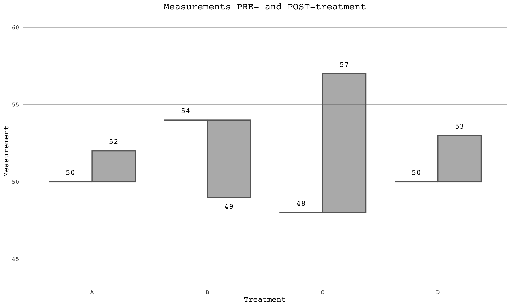

<!-- README.md is generated from README.Rmd. Please edit that file -->

# gghat

<!-- badges: start -->
<!-- badges: end -->

The goal of gghat is to add functionality to ggplot, such that hat
graphs are included in its repertoire. To this end, gghat contains the
hat geom as well as compatible position functions to be used with the
text and errorbar geoms.

## Installation

You can install the development version of gghat from GitHub:

``` r
# install.packages("devtools")
# library(devtools)
# devtools::install_github("eliashyde/gghat")
```

## Example

Below is an example of gghat’s functionality in the context of the
tidyverse. For a more detailed exploration of the package, please look
to the relevant vignette. This code just gives a glimpse of a few of
pertinent features:

``` r
library(tidyverse)
#> ── Attaching core tidyverse packages ──────────────────────── tidyverse 2.0.0 ──
#> ✔ dplyr     1.1.4     ✔ readr     2.1.5
#> ✔ forcats   1.0.0     ✔ stringr   1.5.1
#> ✔ ggplot2   3.5.1     ✔ tibble    3.2.1
#> ✔ lubridate 1.9.3     ✔ tidyr     1.3.1
#> ✔ purrr     1.0.2     
#> ── Conflicts ────────────────────────────────────────── tidyverse_conflicts() ──
#> ✖ dplyr::filter() masks stats::filter()
#> ✖ dplyr::lag()    masks stats::lag()
#> ℹ Use the conflicted package (<http://conflicted.r-lib.org/>) to force all conflicts to become errors
library(gghat)

my_data <- tibble(
  treatment = c("A", "B", "C", "D"),
  pre_treatment_means = c(50, 54, 48, 50),
  post_treatment_means = c(52, 49, 57, 53)
) |> 
  pivot_longer(!treatment, names_to = "condition", values_to = "mean") |> 
  mutate(condition = fct_relevel(condition, "pre_treatment_means", "post_treatment_means"))

ggplot(my_data, aes(x = treatment, y = mean, group = condition)) +
  geom_hat(backwards = FALSE, width = 0.75, alpha = 0.5) +
  geom_text(aes(label = mean), family = "Courier",
            position = position_dodgedifftext(width = 0.75, nudge = 0.6)) +
  coord_cartesian(ylim = c(44, 60)) +
  theme_minimal() +
  theme(
    text = element_text(family = "Courier"),
    legend.position = "none",
    panel.grid.major.x = element_blank(),
    panel.grid.major.y = element_line(linewidth = 0.1, color = "black"),
    panel.grid.minor.y = element_blank(),
    plot.title = element_text(hjust = 0.5)
  ) +
  xlab("Treatment") +
  ylab("Measurement") +
  ggtitle("Measurements PRE- and POST-treatment")
```


